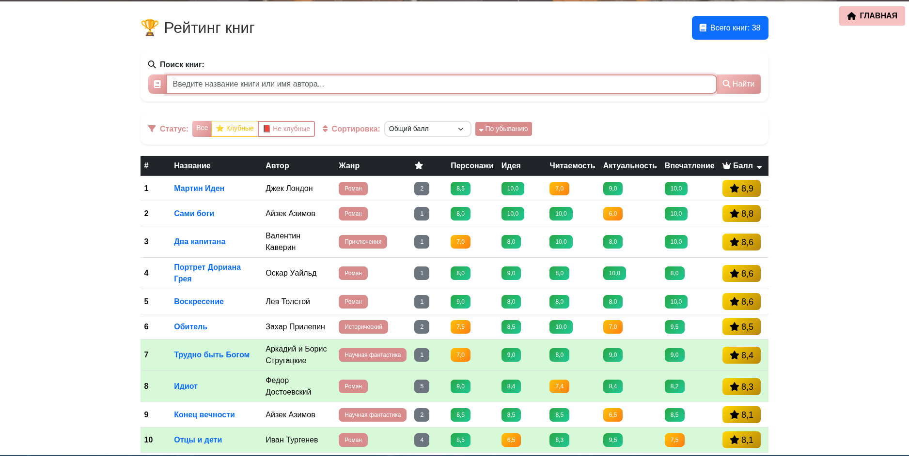
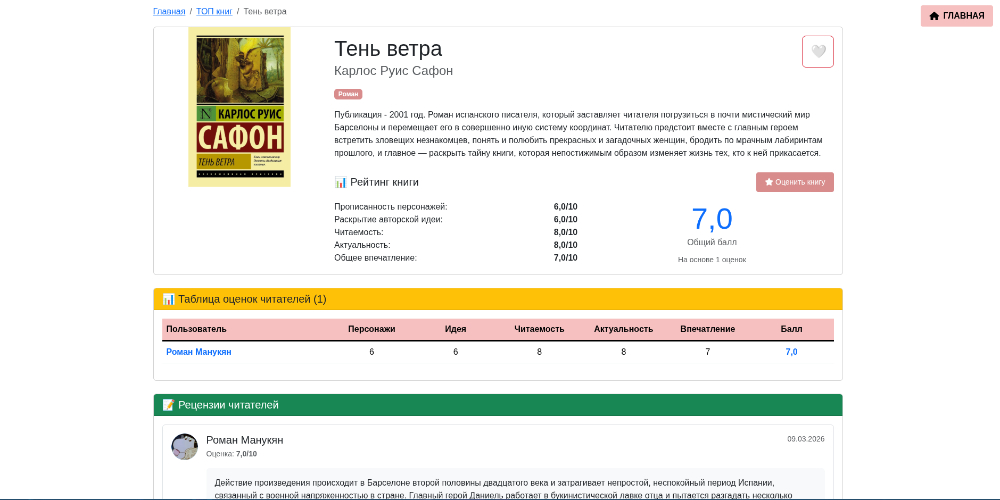
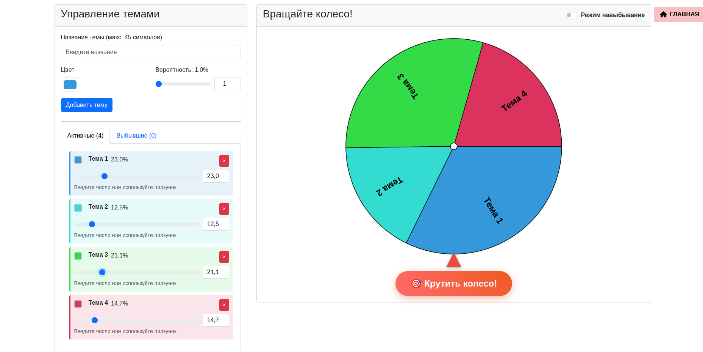
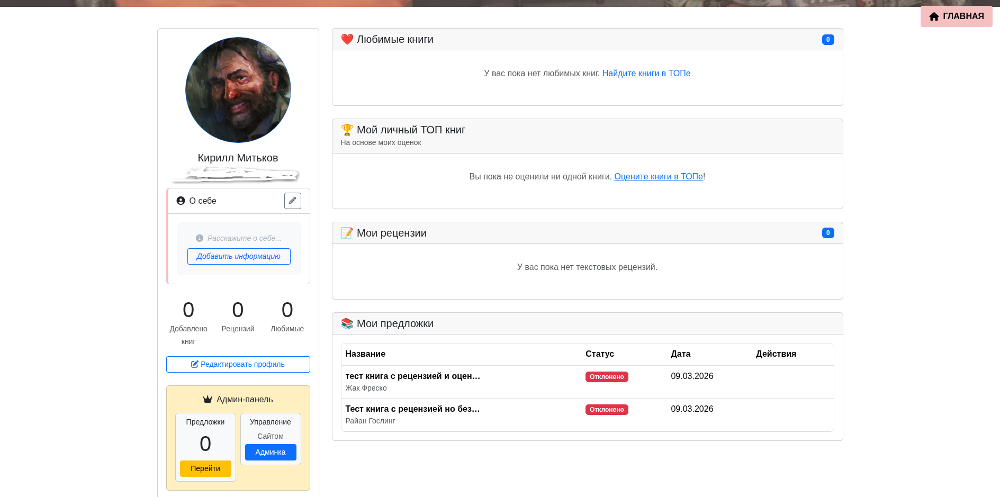

## Клуб любителей книг "В доме на курьих ножках"

  

 <strong>Социальная платформа для книжных клубов: обсуждайте, оценивайте и открывайте новые книги вместе!</strong> 
 

## Оглавление
# О проекте

Основные возможности
Технологический стек
Установка и запуск
Структура проекта
Роли пользователей
API и маршруты
Скриншоты
Вклад в проект
Команда
Лицензия

## О проекте
# "В доме на курьих ножках" — это уютный книжный клуб, где каждый участник может:

-Делиться любимыми книгами

-Оставлять рецензии и оценки

-Случайным образом выбирать следующую книгу для чтения с помощью "Колеса Фортуны"

-Общаться с единомышленниками

Проект создан для объединения любителей книг и создания комфортной среды для обсуждения литературы.

## Основные возможности

# Книги
Функция	Описание
ТОП книг	Рейтинг книг на основе оценок участников
Детальная страница	Полная информация о книге, рецензии, оценки
Поиск	Умный поиск по названию и автору (без учёта регистра)
Сортировка	По общему баллу, персонажам, идее, читаемости и др.
Избранное	Добавляйте книги в личный список любимых

# Пользователи
Функция	Описание
Профиль	Личный кабинет с аватаркой, био и статистикой
Рецензии	Текстовые рецензии с возможностью оценки по 5 критериям
Предложки	Возможность предлагать книги для добавления в ТОП
Модерация	Администраторы могут одобрять/отклонять предложки

# Колесо Фортуны
Функция	Описание
Создание тем	Добавляйте темы для случайного выбора
Режим навыбывание	Выбывшая тема убирается до следующего раунда
Вероятности	Настройка вероятности выпадения каждой темы
Визуализация	Красочное колесо с анимацией вращения

# Технологический стек

Категория	Технологии
Backend	Django 5.2, Django ORM, Python 3.14
Frontend	HTML5, CSS3, Bootstrap 5, JavaScript, Font Awesome 6
База данных	SQLite 3
Аутентификация	Django Auth, Password Reset
Работа с изображениями	Django ImageField, Кадрирование аватаров

## Структура проекта
<pre>
book-club/
├── bookapp/                 # Конфигурация проекта
├── books/                   # Приложение для книг
│   ├── templates/books/    # Шаблоны для книг
│   ├── static/books/       # CSS/JS для книг
│   ├── models.py           # Модели Book, Review, Submission
│   ├── views.py            # Логика отображения
│   └── forms.py            # Формы для книг
├── users/                   # Приложение для пользователей
│   ├── templates/users/    # Шаблоны профилей
│   ├── static/users/       # CSS/JS для пользователей
│   ├── models.py           # Модель User с аватаром
│   └── views.py            # Профили, регистрация
├── games/                   # Приложение Колесо Фортуны
│   ├── templates/games/    # Шаблоны колеса
│   ├── static/games/       # CSS/JS для колеса
│   └── models.py           # Темы, конфигурации
├── templates/               # Общие шаблоны
│   ├── base.html           # Базовый шаблон
│   ├── home.html           # Главная страница
│   └── registration/       # Шаблоны аутентификации
├── static/                  # Статические файлы
└── manage.py                # Точка входа
</pre>

## Пошаговая установка
# Клонируйте репозиторий
git clone https://github.com/Wesley1012/Django_BookApp.git  
cd Django_BookApp 

# Создайте виртуальное окружение
python -m venv venv  
source venv/bin/activate  # для Linux/Mac  
venv\Scripts\activate  # для Windows  

# Установите зависимости
pip install -r requirements.txt  

# Примените миграции
python manage.py migrate  

# Создайте суперпользователя
python manage.py createsuperuser  

# Запустите сервер
python manage.py runserver  

# Откройте в браузере
http://127.0.0.1:8000

## Роли пользователей
# Обычный пользователь
-Регистрация и вход
-Написание рецензий
-Оценка книг
-Добавление книг в избранное
-Использование Колеса Фортуны

# Администратор
-Всё, что может обычный пользователь
-Модерация предложок
-Управление книгами в ТОПе
-Редактирование информации о книгах
-Доступ к админ-панели Django

🔗 API и маршруты
Основные маршруты  
URL	Название	Описание  
/	home	Главная страница  
/books/top/	books:top_books	ТОП книг  
/books/book/<int:pk>/	books:book_detail	Детальная страница книги  
/books/submit/	books:submit_book	Предложить книгу  
/users/profile/	my_profile	Личный кабинет  
/users/members/	members_list	Список участников  
/games/	wheel_dashboard	Колесо Фортуны  
/admin/	admin:index	Админ-панель  

div align="center">
  
| Главная страница | ТОП книг | Детальная страница |
|------------------|----------|-------------------|
|  |  |  |

| Колесо Фортуны | Профиль |
|----------------|---------|
|  |  |

  

 
Сделано с любовью❤️ для книжного клуба "Дом на курьих ножках"
 
© 2026 Киря и Ваня
 

